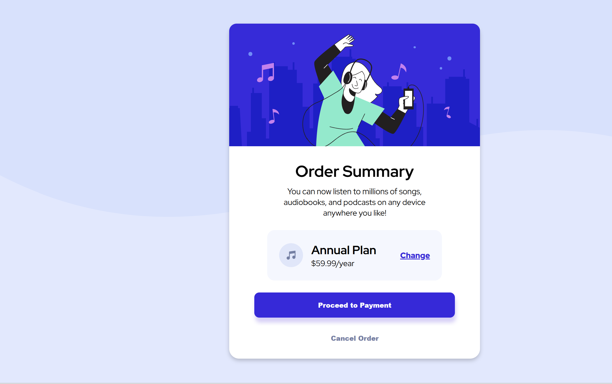

# Frontend Mentor - Order summary card solution

This is a solution to the [Order summary card challenge on Frontend Mentor](https://www.frontendmentor.io/challenges/order-summary-component-QlPmajDUj).

## Table of contents

- [Overview](#overview)
  - [The challenge](#the-challenge)
  - [Screenshot](#screenshot)
  - [Links](#links)
- [My process](#my-process)
  - [Built with](#built-with)
- [Author](#author)

## Overview

### The challenge

Users should be able to:

- Developed a responsive website based on the provided design specifications.

- Ensured the website is fully responsive across all device sizes.

- No user interaction or dynamic functionality was implemented; it is a static website.

- Focused on matching the given design as closely as possible. 

### Screenshot
 ### Desktop: 
 ### Mobile: 

### Links

- Solution URL: [Add solution URL here](https://your-solution-url.com)
- Live Site URL: [Add live site URL here](https://your-live-site-url.com)

## My process
### Built with

- Semantic HTML5 markup
- CSS custom properties
- Flexbox

## Author
AravindhNC
